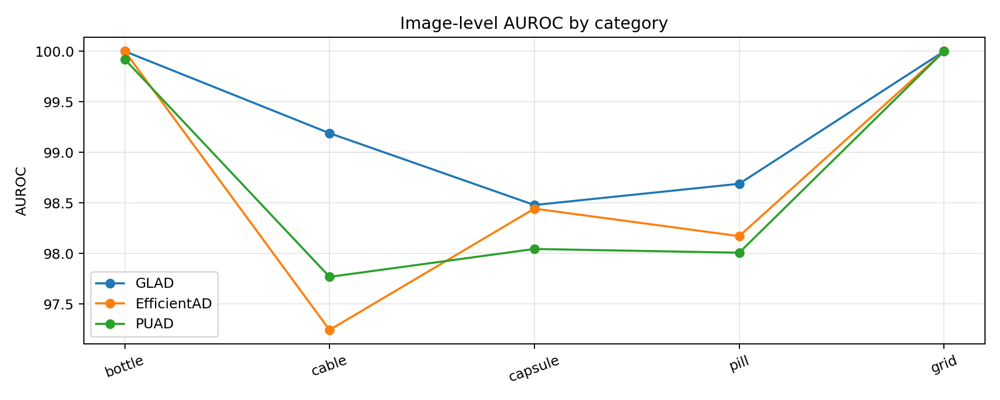

# industrial-anomaly-detection-comparizon-experiment

MVTec-AD を対象に、**GLAD / EfficientAD / PUAD** の3手法を **5カテゴリ（bottle / cable / capsule / pill / grid）** で比較した異常検知実験リポジトリです。  
単に公開実装を実行するだけでなく、**Colab 上での再現、依存関係修正、評価指標の統一、カテゴリ横断の比較表・可視化・考察** まで含めて整理しています。

---

## Overview

産業異常検知では、手法の良し悪しを **1つの指標だけでは判断できません**。  
そこで本実験では、以下の2軸で比較しました。

- **image-level**: 画像全体として異常かどうか
- **pixel-level**: 画像内のどこが異常か

比較対象は以下の3手法です。

- **GLAD**  
  Diffusion ベース再構成と DINO 特徴を用いた異常検知
- **EfficientAD**  
  軽量かつ高速な anomaly detection 手法
- **PUAD**  
  EfficientAD をベースに picturable / unpicturable anomaly を統合した手法

---

## Compared Methods

### GLAD
GLAD は diffusion ベースの再構成と DINO 特徴を使って異常を捉える手法です。  
ざっくりいうと、**正常らしい再構成画像とのズレ**や**特徴差**から異常箇所を推定します。  
今回比較してみて、GLAD は **pixel-level の局所化性能が強い**ことが確認できました。

### EfficientAD
EfficientAD は teacher / student / autoencoder を組み合わせた軽量な異常検知手法です。  
シンプルで高速な構造ながら高精度で、実運用目線でもかなり魅力があります。  
今回の比較では、**画像全体として異常かどうかを判定する image-level 指標が特に強い**という結果でした。

### PUAD
PUAD は EfficientAD をベースに、picturable anomaly と unpicturable anomaly の両方を扱う発展的な手法です。  
今回使った公開実装では主に **image-level の性能評価** が中心になります。  
ただし anomaly-wise AUROC を出せるので、**異常タイプごとの得意・不得意が見える**のが面白いです。

---

## Dataset and Categories

### Dataset
- [MVTec AD Dataset](https://www.mvtec.com/company/research/datasets/mvtec-ad)

### Evaluated Categories
- bottle
- cable
- capsule
- pill
- grid

この5カテゴリを選んだ理由は、物体系とテクスチャ系を混ぜることで、手法の得意・不得意が比較的明瞭に出るためです。

---

## Main Results

### 5カテゴリ平均

| Method | Image_AUROC | Pixel_AUROC | Pixel_AP | PRO / AUPRO |
|---|---:|---:|---:|---:|
| EfficientAD | 98.772 | 97.989 | 45.683 | 91.009 |
| GLAD | 98.654 | 98.516 | 66.926 | 96.070 |
| PUAD | 98.749 | - | - | - |

### 解釈
- **Image-level 判定**では、EfficientAD と PUAD が非常に強い
- **Pixel-level 局所化**では、GLAD が明確に優位
- 特に `Pixel_AP` と `PRO / AUPRO` で GLAD が大きく上回っており、異常領域をより実用的な形で捉えていることが分かる
- 一方で `pill` のように、GLAD は image-level では不利でも pixel-level では強いカテゴリがあり、手法ごとの性質の違いが見えた

---

## Per-category Comparison

| Method | Dataset | Category | Image_AUROC | Pixel_AUROC | Pixel_AP | PRO_or_AUPRO | Notes |
|---|---|---|---:|---:|---:|---:|---|
| GLAD | MVTec-AD | bottle | 100.000 | 98.650 | 85.250 | 96.100 | checkpoint_step=2500 |
| EfficientAD | MVTec-AD | bottle | 100.000 | 97.162 | 55.720 | 88.990 | efficient_ad_pixel_eval |
| PUAD | MVTec-AD | bottle | 99.921 | - | - | - | feature_extractor=student |
| GLAD | MVTec-AD | cable | 99.100 | 98.000 | 66.720 | 93.540 | checkpoint_step=1500 |
| EfficientAD | MVTec-AD | cable | 97.245 | 98.231 | 66.039 | 90.743 | efficient_ad_pixel_eval |
| PUAD | MVTec-AD | cable | 97.770 | - | - | - | feature_extractor=student |
| GLAD | MVTec-AD | capsule | 99.600 | 98.640 | 53.700 | 94.980 | checkpoint_step=2000 |
| EfficientAD | MVTec-AD | capsule | 98.444 | 98.605 | 33.174 | 91.914 | efficient_ad_pixel_eval |
| PUAD | MVTec-AD | capsule | 98.045 | - | - | - | feature_extractor=student |
| GLAD | MVTec-AD | pill | 94.570 | 97.770 | 75.200 | 97.560 | checkpoint_step=1500 |
| EfficientAD | MVTec-AD | pill | 98.172 | 97.752 | 48.868 | 89.810 | efficient_ad_pixel_eval |
| PUAD | MVTec-AD | pill | 98.009 | - | - | - | feature_extractor=student |
| GLAD | MVTec-AD | grid | 100.000 | 99.520 | 53.760 | 98.170 | checkpoint_step=3000 |
| EfficientAD | MVTec-AD | grid | 100.000 | 98.195 | 24.614 | 93.589 | efficient_ad_pixel_eval |
| PUAD | MVTec-AD | grid | 100.000 | - | - | - | feature_extractor=student |

---

## Key Observations

### 1. GLADはピクセルレベルでの異常検知に優れる
GLAD は平均 `Pixel_AUROC`, `Pixel_AP`, `PRO / AUPRO` のすべてで EfficientAD を上回りました。  
とくに `Pixel_AP` の差が大きく、**異常領域の位置推定や領域品質に強い**ことが分かります。

### 2. EfficientAD / PUADは画像レベルでの分類において非常に高い競争力をもつ
EfficientAD と PUAD は平均 `Image_AUROC` で GLAD をわずかに上回りました。  
これは、**画像全体として異常かどうかを判定する用途**では、軽量系手法が非常に実用的であることを示しています。

### 3. 各手法に対して強い評価指標をもつ
`pill` では、GLAD の `Image_AUROC` は下がる一方で、pixel-level 指標は強いままでした。  
つまり、GLAD は **局所異常の抽出は得意だが、画像全体スコアへの集約が弱くなる場合がある**ことが示唆されます。

### 4. PUADは画像レベルの異常検出の強化手法として有用である
今回用いた公開実装では、PUAD は pixel-level map を直接出していません。  
そのため、本比較では **image-level を強化する派生手法** として位置付けています。  
一方で anomaly-wise AUROC が出せるため、**異常タイプごとの得意・不得意を分析できる**という利点があります。

---

## Qualitative Visualization

### Image-level comparison by category


## Note on qualitative visualization

The visualization format is not perfectly identical across methods because each public implementation provides different default outputs.

- **GLAD**: input image, reconstructed image, heatmap, predicted anomaly region
- **EfficientAD**: input image, overlay heatmap, anomaly map

Therefore, the qualitative comparison in this repository focuses on **whether each method highlights the anomalous region on the same input image**, rather than enforcing a perfectly identical rendering format across methods.

### GLAD examples

#### bottle
**GLAD visualization example**  
左から、入力画像、再構成画像、異常ヒートマップ、予測異常領域。


#### cable
**GLAD visualization example**  
左から、入力画像、再構成画像、異常ヒートマップ、予測異常領域。


#### capsule
**GLAD visualization example**  
左から、入力画像、再構成画像、異常ヒートマップ、予測異常領域。


#### grid
**GLAD visualization example**  
左から、入力画像、再構成画像、異常ヒートマップ、予測異常領域。


#### pill
**GLAD visualization example**  
左から、入力画像、再構成画像、異常ヒートマップ、予測異常領域。


### EfficientAD examples

#### bottle
**EfficientAD visualization example**  
左から、入力画像、重畳ヒートマップ、anomaly map。


#### cable
**EfficientAD visualization example**  
左から、入力画像、重畳ヒートマップ、anomaly map。


#### capsule
**EfficientAD visualization example**  
左から、入力画像、重畳ヒートマップ、anomaly map。


#### grid
**EfficientAD visualization example**  
左から、入力画像、重畳ヒートマップ、anomaly map。


#### pill
**EfficientAD visualization example**  
左から、入力画像、重畳ヒートマップ、anomaly map。


> Note: 上記の画像パスは README 用の想定配置です。実際の保存先に合わせて変更してください。

---

## Repository Structure

```text
comparison/
├── EfficientAD/
│   ├── bottle/
│   │   └── pixel_metrics.json
│   ├── cable/
│   │   └── pixel_metrics.json
│   ├── capsule/
│   │   └── pixel_metrics.json
│   ├── grid/
│   │   └── pixel_metrics.json
│   └── pill/
│   │   └── pixel_metrics.json
├── GLAD/
│   ├── bottle/
│   │   └── metrics.json
│   ├── cable/
│   │   └── metrics.json
│   ├── capsule/
│   │   └── metrics.json
│   ├── grid/
│   │   └── metrics.json
│   └── pill/
│   │   └── metrics.json
├── PUAD/
│   ├── bottle/
│   │   ├── anomaly_breakdown.json
│   │   └── metrics.json
│   ├── cable/
│   │   ├── anomaly_breakdown.json
│   │   └── metrics.json
│   ├── capsule/
│   ├── grid/
│   │   ├── anomaly_breakdown.json
│   │   └── metrics.json
│   └── pill/
│   │   ├── anomaly_breakdown.json
│   │   └── metrics.json
├── tables/
│   ├── glad_multi_metrics.csv
│   ├── puad_anomaly_breakdown_multi.csv
│   ├── puad_efficientad_multi_metrics.csv
│   ├── multi_category_comparison_raw.csv
│   ├── multi_category_comparison_final.csv
│   ├── multi_category_summary.csv
│   └── multi_category_pixel_compare.csv
├── figures/
│   └── image_auroc_by_category.png
scripts/
├── GLAD_eval_multi.ipynb
├── PUAD_eval_multi.ipynb
└── comparison_multi.ipynb
```

---

## Environment

### GLAD environment
- numpy: `1.26.4`
- torch: `2.10.0+cu128`
- diffusers: `0.29.2`
- transformers: `4.41.2`
- accelerate: `0.27.2`
- GPU: `Tesla T4`
- CUDA available: `True`

### EfficientAD / PUAD environment
- torch: `2.5.1+cu121`
- CUDA version: `12.1`
- GPU: `Tesla T4`
- CUDA available: `True`

### Runtime
- Google Colab
- GPU runtime (T4)

---

## Data and Pretrained Weights

容量の都合で、データセットと事前学習済み重みはこのリポジトリには含めていません。  
以下から取得し、ローカルまたは Colab + Drive 上に配置してください。

### Dataset
- [MVTec AD Dataset](https://www.mvtec.com/company/research/datasets/mvtec-ad)
- [DTD Dataset](https://www.robots.ox.ac.uk/~vgg/data/dtd/)

### Pretrained weights
- [GLAD pretrained weights](https://stuhiteducn-my.sharepoint.com/personal/23b903042_stu_hit_edu_cn/_layouts/15/onedrive.aspx?id=%2Fpersonal%2F23b903042%5Fstu%5Fhit%5Fedu%5Fcn%2FDocuments%2FGLAD&ga=1)
- [EfficientAD pretrained weights](https://drive.google.com/drive/folders/1-NDUVHFbLTI3CmL8FYSYFXpbLExRu_N5)

---

## Expected Directory Layout

```text
industrial-anomaly-detection-comparizon-experiment/
├── comparison/
├── scripts/
├── data/
│   ├── MVTec-AD/
│   └── dtd/
└── pretrained/
    ├── GLAD/
    ├── PUAD/
    └── stable-diffusion-v1-4/
```

---

## How to Reproduce

### 1. GLAD evaluation
`scripts/GLAD_eval_multi.ipynb` を使用します。

- Colab で GLAD 環境を構築
- MVTec-AD / DTD / GLAD checkpoint / Stable Diffusion v1.4 を配置
- 5カテゴリについて metrics を出力
- 必要に応じて可視化画像も保存

### 2. EfficientAD / PUAD evaluation
`scripts/PUAD_eval_multi.ipynb` を使用します。

- Colab で EfficientAD / PUAD 環境を構築
- MVTec-AD と pretrained model を配置
- 5カテゴリについて image-level / pixel-level / anomaly-wise 結果を保存

### 3. Aggregation and comparison
`scripts/comparison_multi.ipynb` を使用します。

- GLAD / EfficientAD / PUAD の JSON 結果を統合
- 比較表・平均表・ピボット表を出力
- グラフ生成
- CSV 保存

---

## What I changed from public implementations

今回の再現では、公開実装をそのまま動かすのではなく、実際には以下のような修正・整理を行いました。

- Colab 環境向けに依存関係を再調整
- NumPy / scikit-image / imgaug 周りの不整合を解消
- GLAD 側のパス解決・checkpoint 配置を整理
- GLAD 公開実装内の typo / NameError を修正
- EfficientAD / PUAD のモデル配置パスを整理
- 結果をカテゴリ横断で統合する比較 notebook を新規作成
- anomaly-wise AUROC や pixel-level の比較 CSV を自動保存
- 可視化画像を比較資料として使える形に変換・保存

---

## Why this project matters

このプロジェクトは、異常検知モデルの単なる比較にとどまりません。  
実際には、次の能力を示すポートフォリオになっています。

- 論文・公開実装の読解
- 再現実験の設計
- Colab 上でのトラブルシューティング
- 複数手法の公平な比較
- 評価指標の整理
- 結果の可視化と考察
- 再利用可能な notebook / CSV / figure の整備

とくに、**「公開実装を読んで直し、比較可能な形まで持っていく」** という部分は、実務の ML / CV エンジニアリングにかなり近い作業だと考えています。

---

## Future Work

- MVTec-AD の全カテゴリへの拡張
- 推論速度 / メモリ使用量の比較
- 可視化画像の体系的な整理
- GLAD の image-level score 集約改善
- 他の industrial anomaly detection 手法との比較
- VisA など他データセットへの展開

---

## Notes

- PUAD の公開実装では pixel-level output を直接比較していないため、pixel-level 指標は GLAD と EfficientAD の比較が中心です
- README 内の画像パスは、実際の配置に合わせて適宜修正してください
- data / pretrained は外部リンクから取得する前提です

---

## Contact

もしこのリポジトリの構成や比較方法が参考になれば、issue や fork で自由に活用してください。
